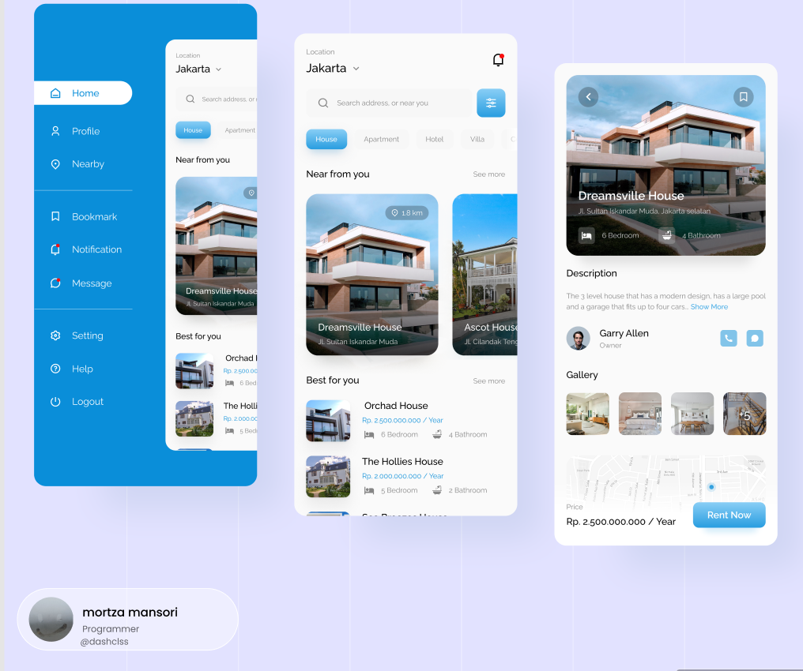

# RentApp
## Progress: Completed


An RentApp in dart/flutter with a Recived Figma design.
In my training days..
Good example for working with Rows and Column.

``
Getx Statemanagment,
Working with Row and col,
Working With ListViews,
Working with Image and Decoration Containers,
Working with data and defining class,
Training..For..ah fun...
``


Thanks for the design: https://www.figma.com/@designbyrendy
```
Design:
https://www.figma.com/community/file/992789948125883979

Coder:
mortza mansori
```

